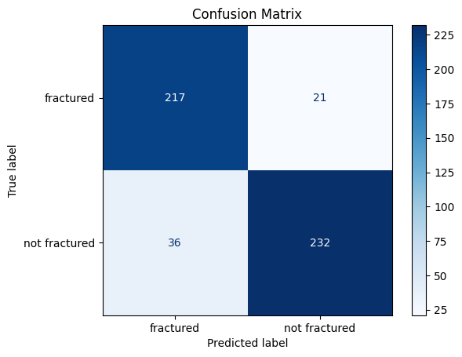
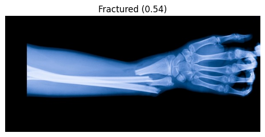

# Bone Fracture Classification using Transfer Learning (ResNet18)

## Table of Contents
1. [Project Overview](#project-overview)
2. [Dataset](#dataset)
3. [Model Architecture](#model-architecture)
4. [Data Preprocessing](#data-preprocessing)
5. [Training and Early Stopping](#training-and-early-stopping)
6. [Evaluation and Results](#evaluation-and-results)
7. [Installation](#installation)
8. [Future Improvements](#future-improvements)
9. [Contributing](#contributing)

---

## Project Overview
This project aims to build a binary classification model to detect bone fractures in X-ray images using deep learning. By leveraging transfer learning with the pre-trained ResNet18 model, we fine-tune the model for fracture detection, making it an effective tool for assisting radiologists in identifying fractures.

Key Highlights:
- **Model**: ResNet18 (pre-trained on ImageNet, fine-tuned for fracture classification).
- **Output**: Binary classification (Fractured vs. Not Fractured).
- **Techniques Used**: Transfer learning, data augmentation, early stopping, and learning rate scheduling.

## Dataset
The dataset consists of X-ray images classified into two categories:
- **Fractured**
- **Not Fractured**

### Directory Structure:
    dataset/
    ├── train/
    │   ├── fractured/
    │   └── not_fractured/
    ├── val/
    │   ├── fractured/
    │   └── not_fractured/
    └── test/
    ├── fractured/
    └── not_fractured/

### Data Details:
- **Training Set**: Images used to train the model.
- **Validation Set**: Images used to evaluate the model during training.
- **Test Set**: Images used for final evaluation after training.

## Model Architecture
The model is based on **ResNet18**, which has been pre-trained on ImageNet and fine-tuned for binary classification. Key components:
- **Frozen Layers**: All layers except the final fully connected layers.
- **Modified Output Layer**: Adjusted to binary classification with a sigmoid activation function for output.

## Data Preprocessing
We apply several preprocessing techniques to improve model performance and generalization:
- **Training**: 
  - Resize to 224x224 pixels.
  - Random horizontal flip.
  - Random rotation (up to 10 degrees).
  - Random resized crop.
  - Normalize using ImageNet statistics.
- **Validation/Test**:
  - Resize to 224x224 pixels.
  - Normalize using ImageNet statistics.

## Training and Early Stopping
The training uses **Binary Cross Entropy Loss** and the **Adam Optimizer**, with the following additional components:
- **Early Stopping**: Stops training if the validation loss does not improve after a specified number of epochs (patience).
- **Learning Rate Scheduling**: Reduces the learning rate by a factor of 0.1 every 5 epochs to allow for finer optimization as training progresses.

## Evaluation and Results

### Key Performance Metrics:
- **Accuracy**: 86.76% on the test set
- **Classification Report**:

                       precision    recall  f1-score   support

          fractured       0.86      0.91      0.88       238
      not fractured       0.92      0.87      0.89       268

           accuracy                           0.89       506
          macro avg       0.89      0.89      0.89       506
       weighted avg       0.89      0.89      0.89       506


- **Confusion Matrix**:

    <!-- Ensure the file is saved as confusion_matrix.png -->
  
### Sample Prediction Output:
   <!-- Ensure the file is saved as predicted_output.png -->

### Notes on Evaluation:
- **Accuracy**: The model achieved 89% accuracy on the test set, indicating its ability to differentiate between fractured and non-fractured images.
- **Confusion Matrix**: Provides detailed insights into false positives and false negatives.
- **Classification Report**: Displays precision, recall, and F1-score for both classes, which is essential for understanding the model's performance on imbalanced datasets.

## Installation

To run this project locally, follow these steps:

### Prerequisites
- Python 3.x
- PyTorch
- scikit-learn
- Matplotlib
- Pillow

## Future Improvements
Potential enhancements to improve this project include:

1. **Model Enhancement**:
   - Experiment with more complex architectures like ResNet50, DenseNet, or EfficientNet to improve classification accuracy.
   - 
2. **Data Augmentation**:
   - Apply additional augmentation techniques such as Random Vertical Flip, Color Jitter, Cutout, and Mixup to improve generalization and robustness.
   
3. **Ensemble Methods**:
   - Combine multiple models (e.g., ResNet18, ResNet50) using Voting Classifier or Stacking to improve accuracy and reduce bias.
Cross-Dataset Evaluation:

4. **Cross-Dataset Evaluation**:
   - Evaluate the model on different datasets to test its generalization across various domains.

5. **Deployment**:
   - Deploy the model as a web app (e.g., Flask, FastAPI) for real-time predictions and clinical use.

---

## Contributing
We welcome contributions! To contribute, follow these steps:

1. **Fork the Repository**:  
   Fork this repository by clicking the "Fork" button at the top right.

2. **Clone the Repository**:  
   Clone it to your local machine:
   ```bash
   git clone https:https://github.com/danish9491/ML-Projects.git
   cd bone-fracture-classification
